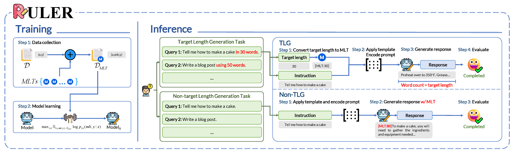
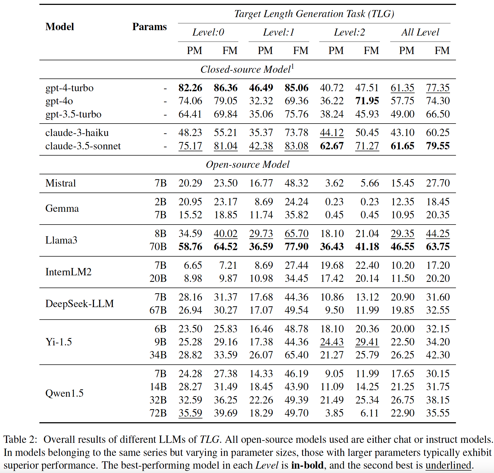
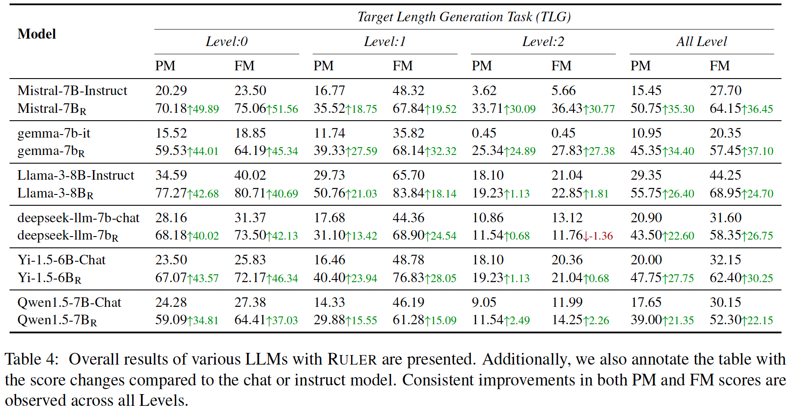
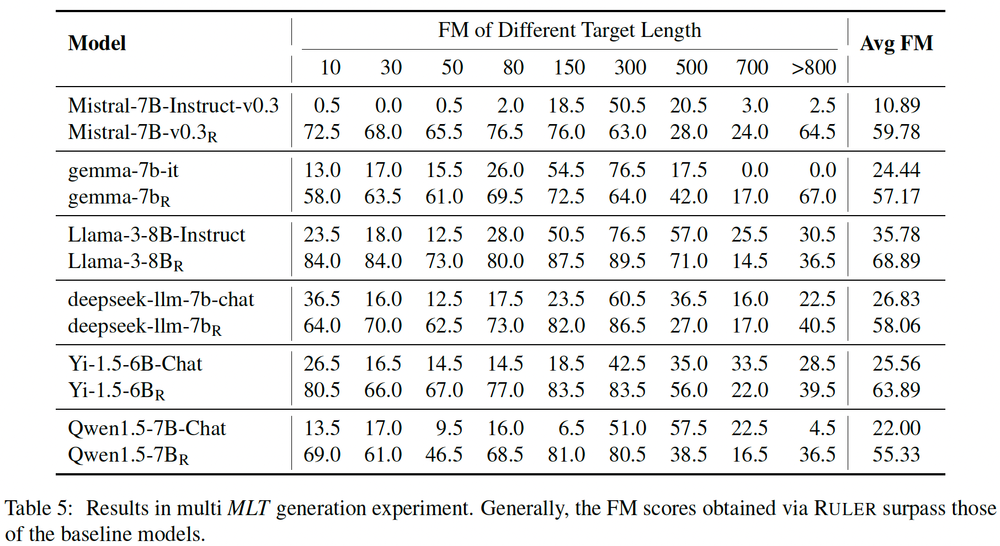
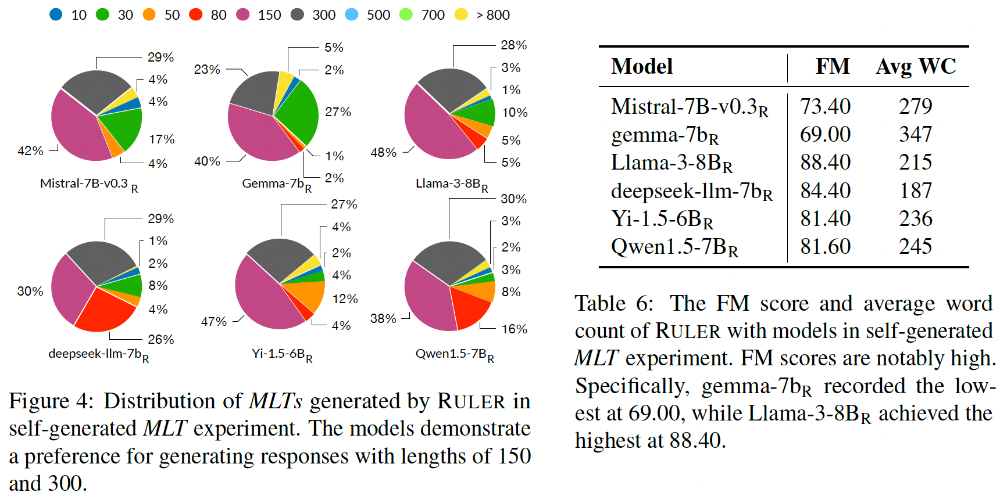

# Ruler: A Model-Agnostic Method to Control Generated Length for Large Language Models

<a href='https://arxiv.org/abs/'></a>



##  🤩 Release
- [2024/09/20] 🥳 [Ruler]() is accepted by EMNLP 2024 Findings.

## 😎 Overview

**Ruler** a novel, model-agnostic approach employs Meta Length Tokens (*MLTs*) to enhance the instruction-following ability of LLMs under length-constrained instructions

**Ruler** equips LLMs with the ability to generate responses of a target length. Moreover, it can automatically generate appropriate *MLT* when not target length is provided. Comprehensive experments show the effectiveness of **Ruler** across different LLMs.

## 🧐 Quickstart

We also provide a more [detailed experiments document](./experiments.md) (specific to each experiment and including all the results!).

### Prepare Environment

First, you should set up a python environment. This code base has been tested under python 3.x, and we officially support python 3.10.
```bash
conda create -n ruler python=3.10
cd Ruler # where contains 'requirements.txt'
pip install -r requirements.txt

export PYTHONPATH=xxxx/Ruler/src
cd src

# create folders and download datasets
bash ../scripts/download.sh
```
### Target Length Generation Task

**Closed-source Model**

```shell
python exp/run_exp_api.py\
  --dataset_path ../datasets/tlg_dataset.jsonl\
  --model <MODEL>\
  --output_path ../outputs/tlg/tlg_<MODEL_NAME>.jsonl
  --key <MODEL KEY>
```

**Open-source Model**

```shell
python exp/run_exp.py\
  --dataset_path ../datasets/tlg_dataset.jsonl\
  --model_name_or_path <PATH_TO_THE_MODEL>\
  --output_path ../outputs/tlg/tlg_<MODEL_NAME>.jsonl
```

**Calculate scores**

Different `Levels`:

```shell
python exp/cal_level_scores.py\
  --dataset_path <PATH_TO_GENERATED_JSONL>
```

Different `MLT`:

```shell
python exp/cal_mlt_scores.py\
  --dataset_path <PATH_TO_GENERATED_JSONL>
```



### Ruler

Finetuning scripts:
```shell
export CUDA_VISIBLE_DEVICES=0,1,2,3

find_free_port() {
    while :
    do
        PORT=$(( ( RANDOM % 64512 ) + 1024 ))
        (echo >/dev/tcp/localhost/$PORT) >/dev/null 2>&1
        if [ $? -ne 0 ]; then
            echo $PORT
            return
        fi
    done
}

export MASTER_PORT=$(find_free_port)

LEARNING_RATE=2e-5
NUM_TRAIN_EPOCHS=3
VANILLA=False

MODEL_NAME_OR_PATH=<MODEL_NAME_OR_PATH>
echo "Finetune from: ${MODEL_NAME_OR_PATH}"
MODEL=${MODEL_NAME_OR_PATH##*/}

TEMPLATE=custom
echo "Finetune data template: ${TEMPLATE}"

DATA_PATH=../datasets/ruler_training_dataset.jsonl
echo "Finetune data path: ${DATA_PATH}"

MODEL_MAX_LENGTH=2048
echo "Model max length: ${MODEL_MAX_LENGTH}"

BATCH_SIZE=4
echo "Per device train batch size: ${BATCH_SIZE}"

GRAD_ACCUM=8
echo "Gradient accumulation steps: ${GRAD_ACCUM}"

OUTPUT_DIR="../outputs/checkpoints/ruler_${MODEL}_bs_${BATCH_SIZE}_ga_${GRAD_ACCUM}_lr_${LEARNING_RATE}_eps_${NUM_TRAIN_EPOCHS}"
LOG_DIR=../logs

deepspeed --master_port=$MASTER_PORT finetuning/finetune.py \
  --vanilla $VANILLA \
  --deepspeed ../configs/ds_config_zero3.json \
  --model_name_or_path $MODEL_NAME_OR_PATH \
  --template $TEMPLATE\
  --model_max_length $MODEL_MAX_LENGTH \
  --data_path $DATA_PATH \
  --output_dir $OUTPUT_DIR \
  --bf16 True \
  --tf32 True \
  --per_device_train_batch_size ${BATCH_SIZE} \
  --gradient_accumulation_steps ${GRAD_ACCUM} \
  --gradient_checkpointing True \
  --lr_scheduler_type cosine \
  --learning_rate ${LEARNING_RATE} \
  --warmup_ratio 0.05 \
  --num_train_epochs ${NUM_TRAIN_EPOCHS} \
  --evaluation_strategy no \
  --save_strategy epoch \
  --save_total_limit 1 \
  --logging_steps 5 \
  2>&1 | tee ${LOG_DIR}/output_ruler_${MODEL}.log
```



### Multi MLT Generation Experiment

**Run exp:**

```shell
python exp/run_exp.py\
  --dataset_path ../data/multi_mlt.jsonl\
  --model_name_or_path <MODEL_NAME_OR_PATH>\
  --gpus 1\
  --template <TEMPLATE>\
  --output_path ../outputs/multi_mlt/mmlt_<MDOEL_NAME>.jsonl
```

**Calculate scores**

```shell
python exp/analysis_mmlt.py\
  --dataset_path ../outputs/multi_mlt/mmlt_<MDOEL_NAME>.jsonl
```



### Self-generated MLT Experiment

**Run exp:**

```shell
python exp/run_exp.py\
  --dataset_path ../datasets/self_generated_mlt.jsonl\
  --model_name_or_path <MODEL_NAME_OR_PATH>\
  --gpus 1\
  --template custom\
  --output_path ../outputs/self_generated_mlt/sgm_<MDOEL_NAME>.jsonl
```

**Calculate scores**

```shell
python exp/analysis_sgm.py\
  --dataset_path ../outputs/self_generated_mlt/sgm_<MDOEL_NAME>.jsonl
```



### Overperformance

`lm_eval` script:

```shell
set -ex
export NUMEXPR_MAX_THREADS=128

MODEL=vllm
MODEL_NAME=<MODEL_NAME>
MODEL_NAME_OR_PATH=<MODEL_NAME_OR_PATH>
OUTPUT_PATH=../outputs/overall_performance/${MODEL_NAME}
TOKENIZER_MODE=auto
NUM_GPUS=1
GPU_MEMORY_UTILIZATION=0.8

mkdir -p $OUTPUT_PATH

lm_eval --model $MODEL \
    --model_args pretrained=${MODEL_NAME_OR_PATH},trust_remote_code=True,tokenizer_mode=${TOKENIZER_MODE},tensor_parallel_size=${NUM_GPUS},dtype=auto,gpu_memory_utilization=${GPU_MEMORY_UTILIZATION} \
    --tasks ai2_arc \
    --device cuda \
    --output_path ${OUTPUT_PATH}/${MODEL}_eval_ai2_arc \
    --batch_size 1 \
    --num_fewshot 25 \
    --write_out \
    2>&1 | tee ${OUTPUT_PATH}/${MODEL}_eval_ai2_arc.log

lm_eval --model $MODEL \
    --model_args pretrained=${MODEL_NAME_OR_PATH},trust_remote_code=True,tokenizer_mode=${TOKENIZER_MODE},tensor_parallel_size=${NUM_GPUS},dtype=auto,gpu_memory_utilization=${GPU_MEMORY_UTILIZATION} \
    --tasks hellaswag \
    --device cuda \
    --output_path ${OUTPUT_PATH}/${MODEL}_eval_hellaswag \
    --batch_size 1 \
    --num_fewshot 10 \
    --write_out \
    2>&1 | tee ${OUTPUT_PATH}/${MODEL}_eval_hellaswag.log

lm_eval --model $MODEL \
    --model_args pretrained=${MODEL_NAME_OR_PATH},trust_remote_code=True,tokenizer_mode=${TOKENIZER_MODE},tensor_parallel_size=${NUM_GPUS},dtype=auto,gpu_memory_utilization=${GPU_MEMORY_UTILIZATION} \
    --tasks truthfulqa \
    --device cuda \
    --output_path ${OUTPUT_PATH}/${MODEL}_eval_truthfulqa \
    --batch_size 1 \
    --num_fewshot 0 \
    --write_out \
    2>&1 | tee ${OUTPUT_PATH}/${MODEL}_eval_truthfulqa.log

lm_eval --model $MODEL \
    --model_args pretrained=${MODEL_NAME_OR_PATH},trust_remote_code=True,tokenizer_mode=${TOKENIZER_MODE},tensor_parallel_size=${NUM_GPUS},dtype=auto,gpu_memory_utilization=${GPU_MEMORY_UTILIZATION} \
    --tasks mmlu \
    --device cuda \
    --output_path ${OUTPUT_PATH}/${MODEL}_eval_mmlu \
    --batch_size 1 \
    --num_fewshot 5 \
    --write_out \
    2>&1 | tee ${OUTPUT_PATH}/${MODEL}_eval_mmlu.log

lm_eval --model $MODEL \
    --model_args pretrained=${MODEL_NAME_OR_PATH},trust_remote_code=True,tokenizer_mode=${TOKENIZER_MODE},tensor_parallel_size=${NUM_GPUS},dtype=auto,gpu_memory_utilization=${GPU_MEMORY_UTILIZATION} \
    --tasks winogrande \
    --device cuda \
    --output_path ${OUTPUT_PATH}/${MODEL}_eval_winogrande \
    --batch_size 1 \
    --num_fewshot 5 \
    --write_out \
    2>&1 | tee ${OUTPUT_PATH}/${MODEL}_eval_winogrande.log

lm_eval --model $MODEL \
    --model_args pretrained=${MODEL_NAME_OR_PATH},trust_remote_code=True,tokenizer_mode=${TOKENIZER_MODE},tensor_parallel_size=${NUM_GPUS},dtype=auto,gpu_memory_utilization=${GPU_MEMORY_UTILIZATION} \
    --tasks gsm8k \
    --device cuda \
    --output_path ${OUTPUT_PATH}/${MODEL}_eval_gsm8k \
    --batch_size 1 \
    --num_fewshot 5 \
    --write_out \
    2>&1 | tee ${OUTPUT_PATH}/${MODEL}_eval_gsm8k.log
```


## 😘 Citation

If you finding our work interesting or helpful to you, please cite this repo.

```plain

```

## 🫡 Contact
If you have any questions, feel free to contact us at `jm.li4@siat.ac.cn`